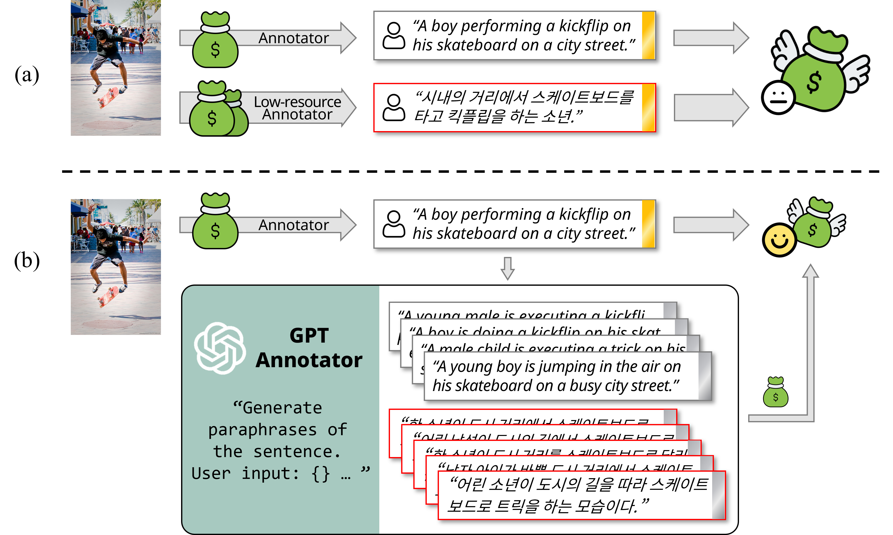

# [EACL 2024 Findings] GPTs are Multilingual Annotators for Sequence Generation Tasks

## Introduction

This repository contains the source code and datasets for the paper ["GPTs Are Multilingual Annotators for Sequence Generation Tasks"](https://aclanthology.org/2024.findings-eacl.2.pdf) accepted at Findings of EACL 2024. By leveraging the multilingual capabilities of LLMs such as GPT, we can easily extend existing datasets to other languages, especially low-resource languages, which requires a significant amount of human effort to collect and annotate. We demonstrate that GPTs can be used as multilingual annotators for sequence generation tasks, such as image captioning and text style transfer, by generating annotations in multiple languages. Please refer to the paper for more details.



## Repository Structure

- `dataset/`: Datasets used in the experiments.
- `experiment/`: Scripts to run the experiments.
- `gpt_annotator/`: Source code for the GPT annotator.

## Citation

If you found this work helpful for your future research, please consider citing this work:

```bibtex
@inproceedings{choi2024gpts,
  title={GPTs Are Multilingual Annotators for Sequence Generation Tasks},
  author={Choi, Juhwan and Lee, Eunju and Jin, Kyohoon and Kim, Youngbin},
  booktitle={Findings of the Association for Computational Linguistics: EACL 2024},
  pages={17--40},
  year={2024}
}
```
